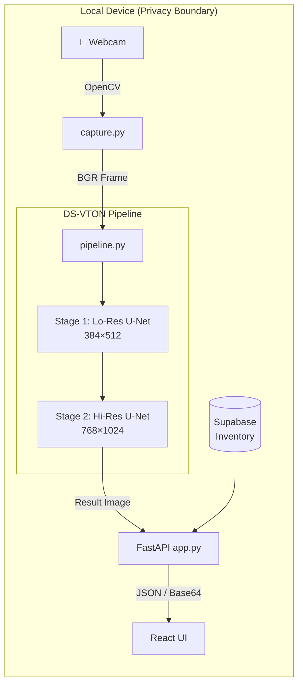

# DS-VTON Architecture — Ainek Smart Mirror

## System Overview



## DS-VTON Pipeline Stages

### Stage 1: Structural Alignment (Low Resolution)

| Property | Value |
|----------|-------|
| Resolution | 384 × 512 (W×H) |
| Latent Size | 48 × 64 |
| Purpose | Coarse body-garment alignment |
| Method | Cross-attention conditioning |
| Input | Person image + Garment features |
| Output | Structurally aligned composite |

### Stage 2: Blend-Refine (High Resolution)

| Property | Value |
|----------|-------|
| Resolution | 768 × 1024 (W×H) |
| Latent Size | 96 × 128 |
| Purpose | Fine detail preservation |
| Method | Blend-refine diffusion |
| Input | Stage 1 output + Person detail features |
| Output | Final try-on result |

## Key Design Decisions

### Mask-Free Design
Unlike traditional virtual try-on approaches (VITON, HR-VITON), DS-VTON operates **without** any human parsing masks or segmentation. The model learns body-garment alignment implicitly through cross-attention mechanisms in the U-Net.

### Dual U-Net Architecture
The dual-scale approach uses **two separate U-Nets** rather than a single multi-scale model:
1. **Low-Res U-Net** — Focuses on global structure and pose adaptation
2. **High-Res U-Net** — Focuses on texture fidelity, pattern detail, and wrinkle generation

### Privacy Architecture
```
┌──────────────────────────────────────────────┐
│  ALL data stays within this box              │
│                                              │
│  Webcam → OpenCV → PyTorch → Display         │
│                                              │
│  ❌ No cloud APIs                            │
│  ❌ No frame upload                          │
│  ❌ No biometric data transmission           │
│  ✅ All inference local (CUDA / CPU)         │
└──────────────────────────────────────────────┘
```

## System Requirements

| Component | Minimum | Recommended |
|-----------|---------|-------------|
| GPU | GTX 1080 (8GB) | RTX 3060+ (12GB) |
| RAM | 16 GB | 32 GB |
| Python | 3.10+ | 3.11 |
| CUDA | 11.8+ | 12.1+ |
| OS | Windows 10 / Ubuntu 20.04 | Windows 11 / Ubuntu 22.04 |
